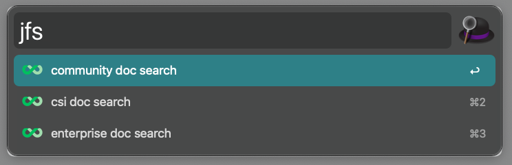
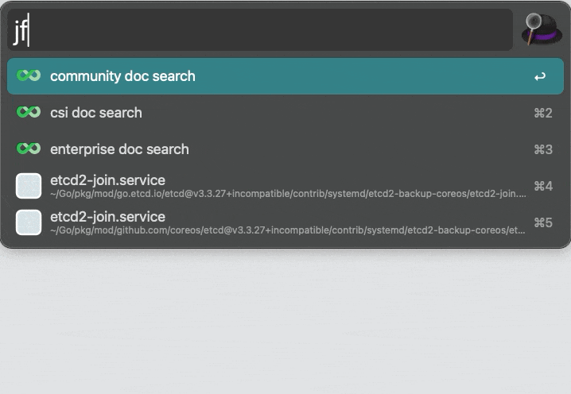
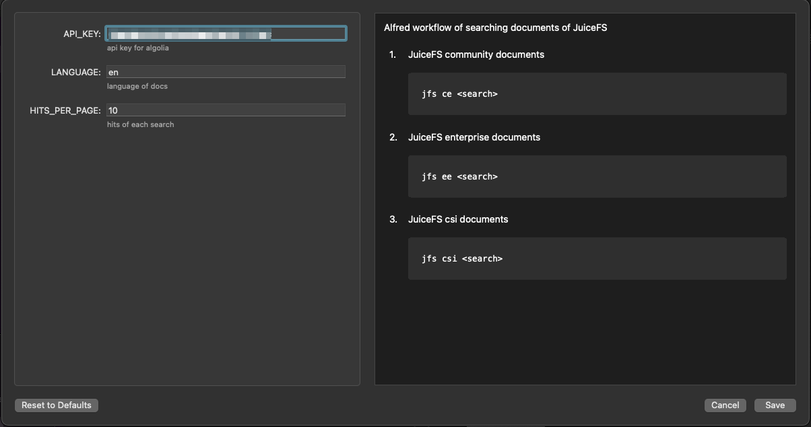

# juicefs search alfred workflow

An Alfred workflow to search documents of JuiceFS with instant results



Simply type your keyword into Alfred (default: jfs) and provide a query to see instant search results from JuiceFS documents.

## Install

Alfred 5 version: [Latest Download](https://github.com/zwwhdls/juicefs-alfred-workflow/releases/download/v0.1.0/JuiceFS.Search.alfredworkflow)

## Usage

Search all documents of JuiceFS, including community, enterprise and csi:

```
# JuiceFS community documents
jfs ce <search>
# JuiceFS enterprise documents
jfs ee <search>
# JuiceFS csi documents
jfs csi <search>
```



## Workflow Variables

- `API_KEY`: Api key for algolia which JuiceFS documents uses. Default value is ok.
- `LANGUAGE`: Language of JuiceFS documents to search. Default is `en`.
- `HITS_PER_PAGE`: Hits of each search. Default is `10`.



